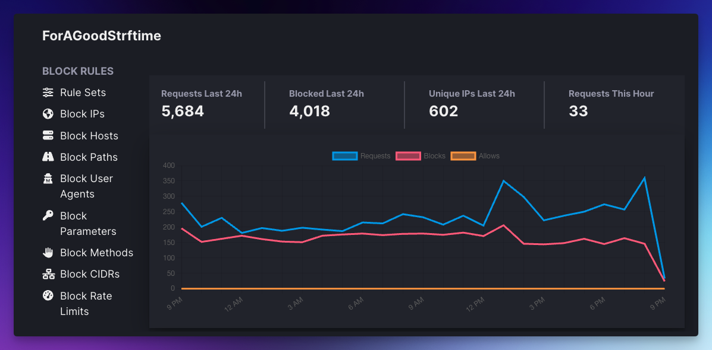

# Wafris for Ruby/Rails 
Wafris is an open-source Web Application Firewall (WAF) that runs within Rails (and other frameworks) powered by Redis. 

Paired with [Wafris Hub](https://wafris.org/hub), you can create rules to block malicious traffic from hitting your application.



Rules like:

- Block IP addresses (IPv6 and IPv4) from making requests
- Block on hosts, paths, user agents, parameters, and methods
- Rate limit (throttle) requests 
- Visualize inbound traffic and requests

Need a better explanation? Read the overview at: [wafris.org](https://wafris.org)

## Installation and Configuration

The Wafris Ruby client is a gem that installs a Rack middleware into your Rails/Sinatra/Rack application that communicates with a Redis instance.

### Requirements
- Redis-rb 4.8+
- Rails 5+
- Ruby 2.5+

## Setup

### 1. Connect on Wafris Hub

Go to https://wafris.org/hub to create a new account and
follow the instructions to link your Redis instance.

**Note:** In Step 3, you'll use this same Redis URL in your app configuration.

### 2. Add the gem to your application

Update your Gemfile to include the Wafris gem and run 
`bundle install`

```
# Gemfile
gem 'wafris'
```

### 3. Set your Redis Connection

Specify your redis with the following initializer. We recommend storing the Redis URL as an environment variable or in a secret management system of your choosing rather than hard coding the string in the initializer.

```ruby
# Create this file and add the following:
# config/initializers/wafris.rb

if ENV["WAFRIS_REDIS_URL"]
  Wafris.configure do |c|
    c.redis = Redis.new(
      url: ENV["WAFRIS_REDIS_URL"]
    )
  end
end
```

For more details and troubleshooting on the initializer, please read our [Wafris Initializer Guide](docs/wafris-initalizer.md).

Not sure what Redis provider to use? Please read our [Wafris Redis Providers Guide](https://wafris.org/guides/redis-provisioning)


### 4. Deploy your application

When deploying your application, you should see the following in your logs:

```
[Wafris] attempting firewall connection via Wafris.configure initializer.
[Wafris] firewall enabled. Connected to Redis on <host from Redis URL>. Ready to process requests. Set rules at: https://wafris.org/hub
```

## Trusted Proxies

If you have Cloudflare, Expedited WAF, or another service in front of your application that modifies the `x-forwarded-for` HTTP Request header, please review how to configure [Trusted Proxy Ranges](docs/trusted-proxies.md)

## Help / Support

- Email: [support@wafris.org](mailto:support@wafris.org)
- Twitter: [@wafrisorg](https://twitter.com/wafrisorg)
- Booking: https://app.harmonizely.com/expedited/wafris


[redis-url]: https://www.iana.org/assignments/uri-schemes/prov/redis

## Credits

Thanks to the following people who have contributed patches or helpful suggestions:

- [Matt Swanson](https://github.com/swanson)
- [Ron Shinall](https://github.com/ron-shinall)
