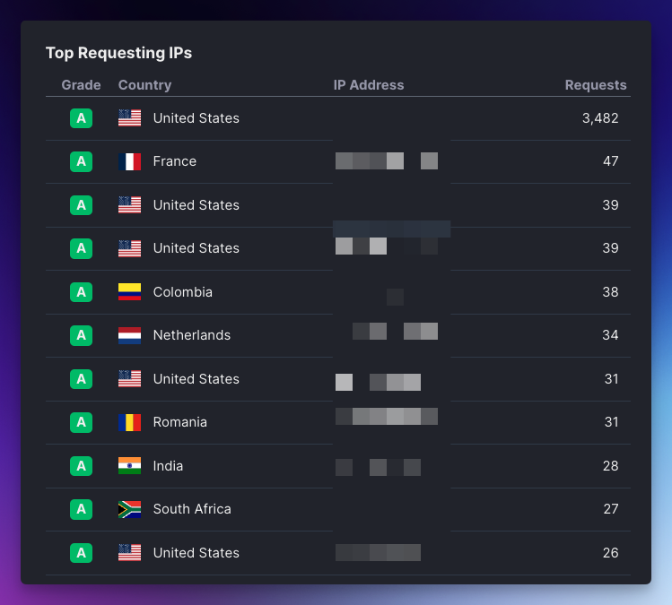
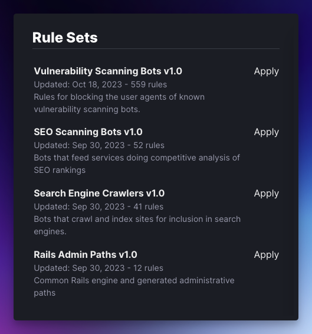

# wafris-rb

## What's Wafris?
Wafris is an open-source Web Application Firewall (WAF) that runs within Rails (and other frameworks) powered by Redis. 

Paired with [Wafris Hub](https://wafris.org/hub), you can create rules to block malicious traffic from hitting your application.


Need a better explanation? Read the overview at: [wafris.org](https://wafris.org)

## What's the Wafris Ruby client (this repository)

The Wafris Ruby client is a gem that installs a Rack middleware into your Rails/Sinatra/Rack app that gives you the ability to:

- Analyze the dark traffic hitting your site
- Determine what requests should be blocked
- Block malicious IP addresses (IPv6 and IPv4) from making requests
- Block on hosts, paths, user agents, parameters, and methods
- Create rate limit rules
- Block by CIDR ranges
- Allow list for IPs and CIDRs
- Detect malicious traffic patterns

Get a real time view of what IPs are hitting your site and how many requests they're making.




Apply pre-built rule sets to your application to automatically block malicious traffic.




## Installation and Configuration

### Requirements
- Redis-rb 4.8+
- Rails 5+
- Ruby 2.5+

If you have a previous version of one of the requirements above, please let us know, and we'll test it.

## Setup


### 1. Connect on Wafris Hub

Go to https://wafris.org/hub to create a new account and
follow the instructions to link your Redis instance.

**Note:** In Step 3, you'll use this same Redis URL in your app configuration.

### 2. Add the gem to your application

Update your Gemfile to include the Wafris gem and run 
`bundle install`

```
# Gemfile
gem 'wafris'
```

### 3. Set your Redis Connection

Specify your [`redis://` URL][redis-url] with the following initializer. We recommend storing the Redis URL as an environment variable or in a secret management system of your choosing rather than hard coding the string in the initializer.

```ruby
# config/initializers/wafris.rb

Wafris.configure do |c|
    c.redis = Redis.new(
      url: ENV['PUT_YOUR_REDIS_URL_HERE'],
      ssl_params: { verify_mode: OpenSSL::SSL::VERIFY_NONE },
      connection_pool: 10
    )
end
```

**Note:** You should not use a shared Redis instance for Wafris and other applications like Rails caching or Sidekiq.

For more information on provisioning and managing your Redis instance, please read our [Wafris Redis Guide](https://wafris.org/guides/redis-provisioning)

If you want to ensure this is working locally before you deploy check out our [testing in development guide](docs/testing-in-dev.md).

### 4. Deploy your application

When deploying your application, you should see the following in your logs:

```
[Wafris] attempting firewall connection via Wafris.configure initializer.
[Wafris] firewall enabled. Connected to Redis on <host from Your Redis URL>. Ready to process requests. Set rules at: https://wafris.org/hub
```

### Trusted Proxies

If you have Cloudflare, Expedited WAF, or another service in front of your application that modifies the `x-forwarded-for` HTTP Request header, please review how to configure [Trusted Proxy Ranges](docs/trusted-proxies.md).

## Help / Support

For any trouble configuring Wafris, please email [support@wafris.org](mailto:support@wafris.org)

Or you can book a time at: https://app.harmonizely.com/expedited/wafris


[redis-url]: https://www.iana.org/assignments/uri-schemes/prov/redis
